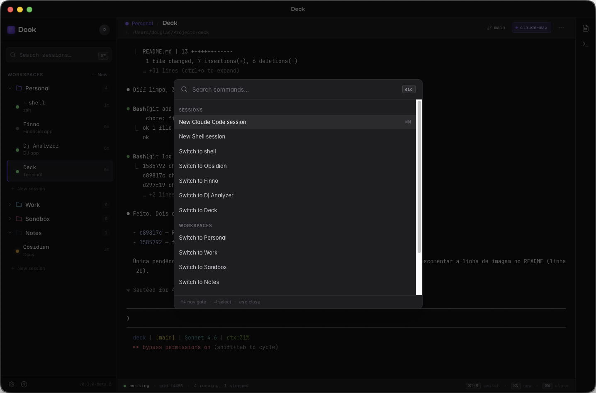

# Deck

Multi-session Claude Code orchestrator for macOS.

[](LICENSE)
[](https://github.com/dougss/deck/releases)
[](https://github.com/dougss/deck/releases)
[]()

---

Run multiple Claude Code sessions in parallel, organized by workspace and git branch. For developers who need to keep multiple agentic conversations alive without context loss.

> **Beta software.** Expect rough edges. File issues on [GitHub](https://github.com/dougss/deck/issues).

---

## Screenshot



> _Screenshot pending — add `docs/screenshots/main-interface.png` before publishing._

---

## Why Deck

- **Parallel sessions, no context loss.** Run executor and exploratory sessions simultaneously without killing conversations.
- **Workspace isolation.** Each project gets its own workspace — sessions, config, and branch context stay separate.
- **Branch-aware workflow.** Switch branches without leaving the app. Cmd+Shift+B opens a searchable switcher across local branches.
- **Hooks surface to the UI.** Claude Code hook events (task done, error) reach Deck as notifications — no terminal-watching required.

---

## Features

- Multi-type sessions: Claude Code and shell, per workspace
- Workspace organization with sidebar navigation
- Branch switcher with search (Cmd+Shift+B)
- Open in IDE: right-click workspace → open in Zed, Cursor, VS Code, or Fork
- Hook notifications for Claude Code state changes (working, done, error)
- Command palette (Cmd+P)
- macOS-native keyboard shortcuts throughout
- Native xterm.js terminal with full PTY support

---

## Installation

### From release

1. Download the `.dmg` from [Releases](https://github.com/dougss/deck/releases)
2. Open the `.dmg` and drag **Deck.app** to `/Applications`
3. On first launch, macOS will block the app (unsigned binary). Run:
   ```sh
   xattr -cr /Applications/Deck.app
   ```
4. Open Deck normally after running the command above

> Deck is not signed with an Apple Developer ID. The `xattr` command removes the Gatekeeper quarantine flag — this is a one-time step.

### From source

```sh
git clone https://github.com/dougss/deck.git
cd deck
pnpm install
```

**Development:**

```sh
pnpm dev
```

**Production build:**

```sh
pnpm build:mac
# Output: dist/Deck-<version>.dmg
```

> Requires Node.js 22 LTS and pnpm.

---

## Quickstart

1. Open Deck — a default workspace is created on first launch
2. Click **+ New session** → choose **Claude Code** or **Shell**
3. Configure the session: name, working directory, and (for Claude Code) the command
4. Open additional sessions with Cmd+N or via Cmd+P → "New Claude Code session"
5. Navigate between sessions using the shortcuts below

### Keyboard shortcuts

| Shortcut    | Action                     |
| ----------- | -------------------------- |
| Cmd+N       | New session                |
| Cmd+W       | Close session              |
| Cmd+1–9     | Switch to session by index |
| Cmd+F       | Search sessions in sidebar |
| Cmd+P       | Command palette            |
| Cmd+Shift+B | Branch switcher            |
| Cmd+Q       | Quit                       |

---

## Architecture

Electron 39 with a standard multi-process architecture. The **main process** (Node.js) handles PTY management via `node-pty`, SQLite persistence via `better-sqlite3`, and IPC routing. A **preload** script exposes a typed `window.deck` API to the renderer. The **renderer** is a React 19 + TypeScript SPA styled with Tailwind CSS v4. Terminal emulation uses `xterm.js`. Client state is managed with Zustand.

---

## Project structure

```
src/
  main/       Electron main process — PTY, SQLite, IPC handlers
  preload/    IPC bridge — exposes window.deck API to the renderer
  renderer/   React UI — components, stores, hooks
  shared/     Types and IPC channel constants
scripts/      Build and install helpers
docs/         Architecture docs, phase plans, design references
```

---

## Roadmap

- Branch switcher: remote branch listing and checkout
- Planner panel: read-only Claude Code session for architecture and planning, embedded in a right sidebar
- More session types: Codex CLI, Gemini CLI alongside Claude Code
- Settings: expanded customization — editor preferences, keyboard shortcuts, appearance

No dates. These are planned, not promised.

---

## Limitations

- **macOS only.** Intel (x64) native. Apple Silicon supported via Rosetta 2. No Windows or Linux support planned.
- **Unsigned binary.** Distributing a signed app requires an Apple Developer ID ($99/year). A Gatekeeper workaround (`xattr -cr`) is required on first launch.
- **Single-user.** No multi-user collaboration or remote session sharing.
- **Requires Claude Code.** Deck orchestrates the `claude` CLI — it does not bundle it. Install and authenticate Claude Code separately.

---

## Contributing

Issues and pull requests are welcome. No formal contribution process yet.

- [Bug reports and feature requests](https://github.com/dougss/deck/issues)
- For larger changes, open an issue to discuss before sending a PR

---

## License

MIT — see [LICENSE](LICENSE) file.

---

## Acknowledgments

- [Anthropic Claude Code](https://github.com/anthropics/claude-code) — the agent this app orchestrates
- Open-source dependencies: `xterm.js`, `node-pty`, `better-sqlite3`, `electron`, React, Tailwind CSS, and the full list in `package.json`
- Design inspiration: [Warp](https://www.warp.dev/), [Wave Terminal](https://www.waveterm.dev/), [Linear](https://linear.app/), [Raycast](https://www.raycast.com/)
